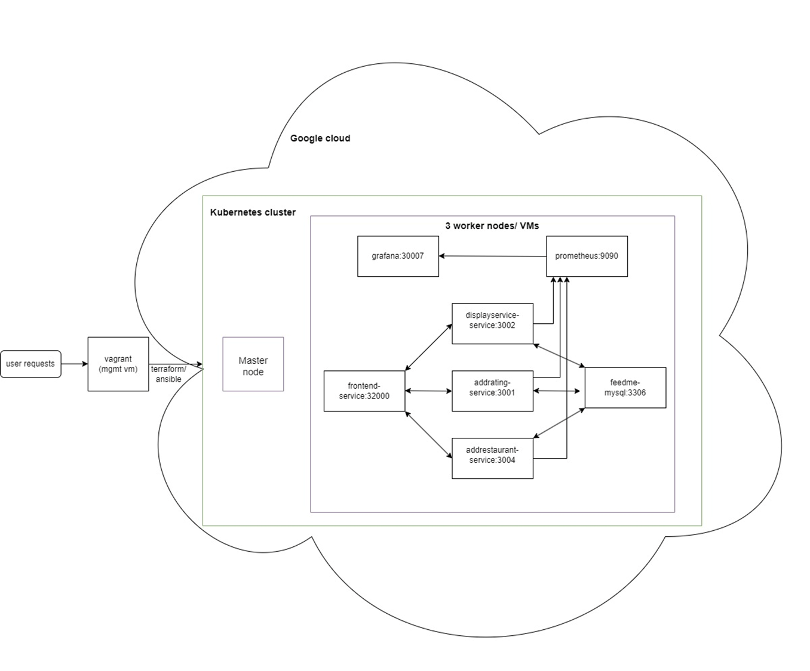

# agisit24-g26
# Feed Me Lisbon

Anna Svendsen
Nora Mosand Viken

FeedMe Lisbon is a web application designed to help visitors and locals explore Lisbon’s dining options by category - whether for breakfast, lunch, dinner or dessert - and allowes them to view ratings, add new restaurants, and contribute their own ratings. Users can also add new restaurants to the application if a favorite spot is missing. 

FeedMe Lisbon’s architecture is designed for cloud deployment, using Google Cloud Platform (GCP) for infrastructure hosting. The application relies on a microservices structure, with each key feature - such as add restaurant, display restaurants and add rating - built as a separate service. Each service is containerized with Docker, and these containers run within a Kubernetes CLuster on the cloud. To ensure that Feed Me Lisbon is easily replicable, manageble and scalable,  we’ve implemented Infrastructure as Code (IaC). This approach uses scripting to automate the configuration of infrastructure components, reducing the risk of human error. This guide provides a clear, step-by-step approach for recreating the FeedMe Lisbon web application, utilizing powerful IaC tools, namely Terraform and Ansible.

## Architecture 

##Prerequisites: 
- You have a Google Cloud User with money charged on the account. 
- Docker is installed on your maskin.

Follow the instructions below to install and configure the entire system. 

### 1 Vagrant Setup
Navigate into the gcpgloud folder in the project repository and run 

    agisit24-g25/gcpgloud> vagrant up 

Access the VM with: 

    agisit24-g25/gcpgloud> vagrant ssh

### 2 Create a new project in Google Cloud and Enable Compute Engine API
Log in to your user in Google Cloud Provider and click on the button that says "Create new project" and give the project a relevant name, for example "feedme-lisbon".

Inside the Google Cloud Console, choose "API and Services" and select "Enable APIs and Services". In the new window search for Compute Engine api. 
Select the Compute ENgine api and enable. 

### 3 Download a credentials file
Still in the Google Cloud Console, navigate to the menu and elect IAM and Admin. Thereafter choose Service Accounts --> keys --> add key --> create new key and select the JSON checkbox in the the pop up. Then click on create, which will creates a Credentials file. Save this file in the gcpcloud folder

### 4 Authorize the API 
Navigate to gcpcloud in the vagrant environment and run the following command: 
    vagrant@mgmt:∼/gcpcloud$ gcloud auth login

Follow the instructions to authenticate yourself.

## Build the infrastructure
### 5 Initialize terraform 
Navigate to the terraform_variables.tf file and locate the variable named "GCP_PROJECT_ID" and change the variable to the project id in Google Cloud. 

Now, Terraform can be initialized running the followoing command.Make sure the terminal is located inside the gcpcloud folder: 

    vagrant@mgmt:∼/gcpcloud$ gcloud auth login

### 6 Generate public/private rsa key pair
Run the following command: 

$ ssh-keygen -t rsa -b 2048

When asked to enter passworkd, just click enter. 

### Execute plan and build infrastructure

Run the two following commands in order to apply the plan specified in the terraform files.

    vagrant@mgmt:∼/gcpcloud$ terraform plan

    vagrant@mgmt:∼/gcpcloud$ terraform apply

After running this, the nodes/workers should be created and viewable in the Google Cloud.

### 8 Configure nodes with ansible
Run the ansible playbook named ansible_configure_nodes.yml:

    ansible-playbook ansible_configure_nodes.yml

### 9 Install Kubernetes on the nodes

Run the ansible_kubernetes_install.yml playbook with the following command: 

    ansible-playbook ansible_kubernetes_install.yml

### 10 Set up the cluster

run the ansible_create_cluster.yml playbook to create the kubernetes cluster: 

    ansible-playbook ansible-create-cluster.yml

To check if Kubernetes was correctly installed and to verify that the cluster was successfully created, navigate to Compute engine, click on the three vertical dots on the master VM and click on view gcloud command. Copy this and paste into terminal to ssh into the master node. Run 

    sudo kubectl version 

inside the master to verify that kubectl was correctly installed. 

run the playbook named ansible_workers_join.yml to make the wokrers join the cluster.

    ansible-playbook ansible_workers_join.yml

run the following command inside master to output the cluster with all nodes: 

    sudo kubectl get nodes

## Start deployment of the Feed Me Lisbon application

### Create Artifact Registry 
Enable Artifact Registry by searching for it in the google console and enable. Create a new repository and name it "feedmerepo"

## 11 Make artifact repository readable to public 

gcloud artifacts repositories add-iam-policy-binding feedmerepo \
    --location="<your-artifact-repo-region>" \
    --memeber="allUsers" \
    --role="roles/artifactregistry.reader" \

### 12 Build docker images and push to cloud
(As we had issues with infrastructure mis-match we had to use dockerx)

Outside vagrant, navigate to the project. Now, four docker images should be built and pushed to cloud by running the two following commands for each of the microservices: 

navigate to backend/addRestaurant and run: 

    docker buildx build --platform linux/amd64 -t europe-west1-docker.pkg.dev/agisit-2425-website-26/feedmerepo/addrestaurant:latest .

    docker push europe-west1-docker.pkg.dev/agisit-2425-website-26/feedmerepo/addrestaurant:latest

navigate to backend/addRating and run: 

    docker buildx build --platform linux/amd64 -t europe-west1-docker.pkg.dev/agisit-2425-website-26/feedmerepo/addrating:latest .

    docker push europe-west1-docker.pkg.dev/agisit-2425-website-26/feedmerepo/addrating:latest

navigate to backend/displayservice and run: 

    docker buildx build --platform linux/amd64 -t europe-west1-docker.pkg.dev/agisit-2425-website-26/feedmerepo/displayservice:latest .

    docker push europe-west1-docker.pkg.dev/agisit-2425-website-26/feedmerepo/displayservice:latest

navigate to frontend/ and run: 

    docker buildx build --platform linux/amd64 -t europe-west1-docker.pkg.dev/agisit-2425-website-26/feedmerepo/frontend:latest .

    docker push europe-west1-docker.pkg.dev/agisit-2425-website-26/feedmerepo/frontend:latest

The images for Prometheus, Grafana and mysql are official images, and we therefore can simply build them directly without building the image first. See next step.

### 13 Ansible start deployment
Deployments, which manages a set of pods, and services are defined in yaml files for each microservice, including mysql database, promotheus and grafana, addrating, addrestaurant and displayservice. 

By running the ansible_start_deployment.yml playbook, the yaml files containing the deployment configurations for the services get copied to the masternode, and are thereafter applied to the kubernetes cluster. 

run the following commmand: 

    ansible-playbook ansible_start_deployment.yml

### 14 Access the web-site 

Now the website should be accessible at the following url: 

    http://<external IP of frontend worker node>:32000